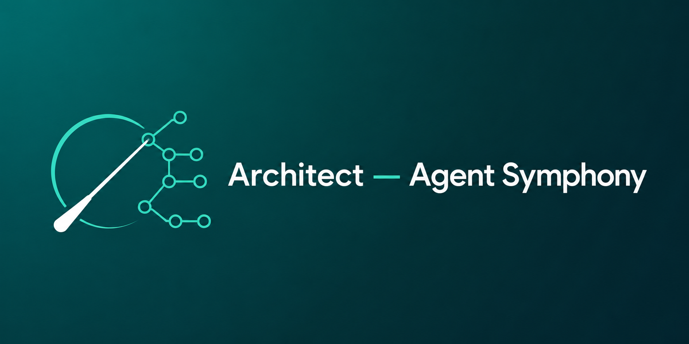
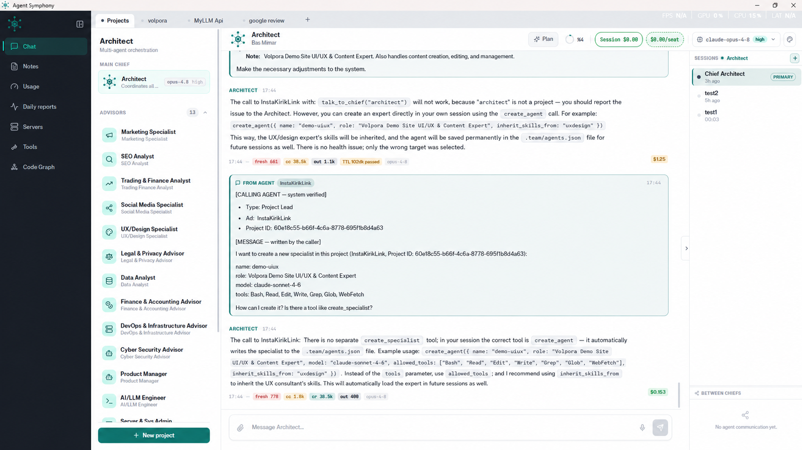
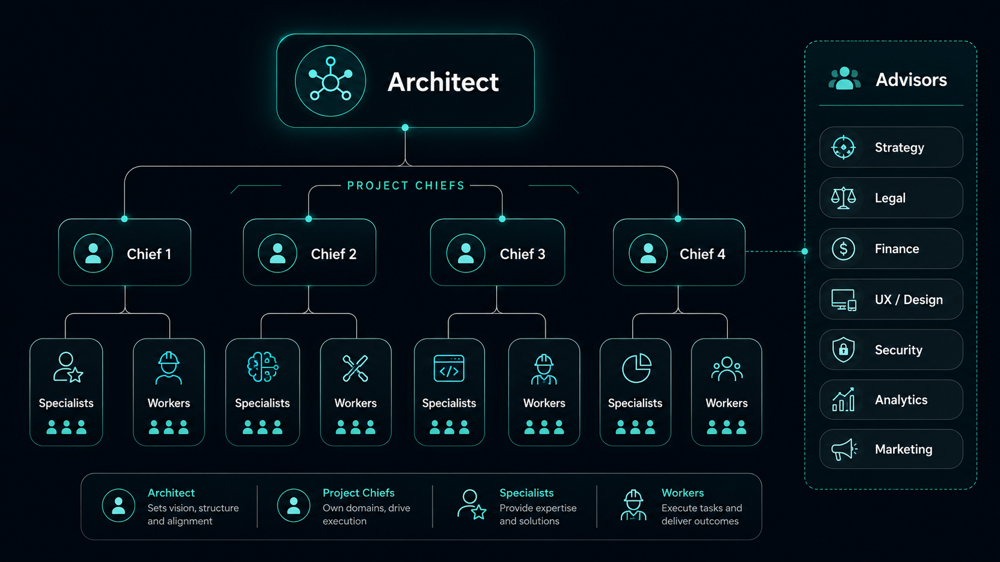

<div align="center">



# Architect — Agent Symphony

### Um orquestrador hierárquico de múltiplos agentes para o Claude Agent SDK — multi-provedor (Claude + DeepSeek)

*Um maestro. Uma companhia de agentes de IA. Você permanece no comando.*

[](https://github.com/sponsors/SeyhmusKaya)
[](https://github.com/SeyhmusKaya/agent-symphony/stargazers)
[](https://github.com/SeyhmusKaya/agent-symphony/releases)
[](https://github.com/SeyhmusKaya/agent-symphony/actions)
[](https://github.com/SeyhmusKaya/agent-symphony/commits/main)
[](LICENSE)
[](https://docs.anthropic.com/en/api/agent-sdk)
[](https://tauri.app)

<br/>

[Türkçe](README.tr.md) · [English](README.md) · [中文](README.zh.md) · [日本語](README.ja.md) · [한국어](README.ko.md) · [Español](README.es.md) · **Português**

</div>

---

## 💜 Apoio / Doação

**Architect — Agent Symphony é gratuito e de código aberto, criado por um desenvolvedor solo.** Se ele economiza seu tempo ou se você simplesmente gosta da ideia, uma doação mantém os agentes funcionando e o desenvolvimento avançando. Obrigado. 🙏

### ⭐ GitHub Sponsors (recomendado)
A maneira mais fácil de apoiar — um clique, recorrente ou único, **0% de taxa de plataforma** (100% chega ao autor):

👉 **[github.com/sponsors/SeyhmusKaya](https://github.com/sponsors/SeyhmusKaya)**

### ₿ Cripto

| Ativo | Rede | Endereço |
|-------|---------|---------|
| **USDT** | **TRC20** (Tron) | `TD5DADsYjH3aydsi7zrgDrqVAj3EzWx1Cb` |
| **BTC** | **Bitcoin** | `12W1kc6qvDEwG9QfdjHWtdT2QEKDrTApWm` |
| **ETH** | **ERC20** (Ethereum) | `0x8d0ba54ba688fe70f1f3888ad494817b9fdebc7b` |

> ⚠️ **Envie cada ativo apenas na rede indicada acima.** Enviar na rede errada pode perder os fundos permanentemente.

---

## ✨ O que é isto?

**Architect — Agent Symphony** é um aplicativo de desktop que transforma o Claude Agent SDK em uma **organização hierárquica de agentes de IA que você orquestra como uma empresa.**

Em vez de conversar com um único assistente, você opera um **organograma de agentes especializados**: um arquiteto-chefe coordena os chefes de projeto, cada chefe comanda seus próprios especialistas persistentes, consulta um painel de consultores de domínio e despacha trabalhadores de tarefa única — tudo em paralelo, tudo em uma única cabine de comando, com visibilidade total de custos e gerenciamento de contexto à altura do Claude Code.

Pense nisso como um **centro de controle de missão para uma equipe de agentes Claude** — projetado especificamente para orquestrar trabalho de software real e multiprojeto.

### 🧭 Onde ele se encaixa

Se você já usou **Claude Code**, **CrewAI**, **AutoGen** ou **LangGraph**: esses são frameworks e CLIs que você *programa*. **Architect — Agent Symphony** é uma **cabine de comando de desktop onde a orquestração *é* o produto** — você observa e comanda uma organização permanente de agentes em projetos reais, com visibilidade ao vivo de custo e contexto, em vez de escrever código de orquestração. Ele é construído diretamente sobre o **[Claude Agent SDK](https://docs.anthropic.com/en/api/agent-sdk)** oficial (em processo, sem CLI separado), de modo que você obtém comportamento à altura do Claude Code com uma interface multiagente e multiprojeto por cima.

**Palavras-chave:** orquestração de agentes Claude · orquestração de agentes DeepSeek · agentes LLM multi-provedor · IA multiagente · fluxos de trabalho agênticos · agentes de codificação autônomos · interface alternativa ao Claude Code · aplicativo de desktop DeepSeek V4 · equipe de software de IA · ferramentas MCP.

---

## 🌟 O que o torna diferente

- 🧬 **Skills por agente** — cada agente carrega seus **próprios** arquivos de skill. Você constrói um especialista de verdade com conhecimento profundo de domínio, não um chatbot genérico usando um crachá.
- 🤖 **Skills atribuídos automaticamente por tarefa** — quando um chefe cria um novo especialista, ele **herda automaticamente os skills de domínio certos** para o trabalho: um especialista em design recebe os skills de design, um de segurança recebe os skills de segurança.
- 🗂️ **Navegue entre projetos como abas de navegador** — alterne entre múltiplos **projetos ativos e sessões paralelas** como abas do Chrome, cada um com seus próprios agentes, contexto, histórico e medidor de custo.
- 💬 **Os agentes conversam entre si** — os chefes consultam os consultores e enviam mensagens a outros chefes de projeto; o trabalho é *negociado entre agentes*, não apenas ditado de cima para baixo por você.
- 🌙 **Autoaperfeiçoamento durante a noite** — o Architect-chefe pode **analisar sua própria base de código toda noite e propor / entregar melhorias de forma autônoma**, de modo que o orquestrador continue melhorando enquanto você dorme.
- ⚡ **Paralelo por padrão** — subtarefas independentes são distribuídas para muitos agentes de uma só vez e, em seguida, o maestro combina os resultados.

---

## 📸 A cabine de comando

<div align="center">

</div>

---

## 🎼 A Sinfonia — como a hierarquia toca

<div align="center">

</div>

```
                        🏛️  ARCHITECT  (the conductor)
                        coordinates everything, owns the ecosystem
                                      │
        ┌─────────────────────────────┼─────────────────────────────┐
        │                             │                             │
   👔 PROJECT CHIEF             👔 PROJECT CHIEF              🎓 ADVISORS (11, fixed)
   owns one project            owns another project          domain decision support
   git · ssh · deploy          git · ssh · deploy            design · SEO · security
        │                             │                       legal · finance · data
        ├── 🧑‍💻 Specialist          ├── 🧑‍💻 Specialist        devops · marketing · …
        ├── 🧑‍💻 Specialist          └── ⚡ Worker (one-shot)   (consulted on demand)
        └── ⚡ Worker (one-shot)
```

| Papel | O que é | Tempo de vida |
|------|-----------|----------|
| 🏛️ **Architect** | O maestro. Coordena todo o ecossistema, desenvolve o próprio orquestrador, encaminha o trabalho entre os chefes. | Sempre ativo |
| 👔 **Project Chief** | Um por projeto. O engenheiro sênior do projeto — é dono do código, do git, do ssh/deploy. Conversa com outros chefes. | Persistente |
| 🧑‍💻 **Specialist** | Um especialista persistente de um chefe (por ex. *Frontend Specialist*, *Backend Specialist*). Escreve e edita código em uma janela de agente paralela e isolada. | Persistente |
| 🎓 **Advisor** | 11 especialistas de domínio fixos (design/UI, SEO, segurança, jurídico, marketing, finanças, contabilidade, dados, devops, social, trading). Suporte à decisão — eles não escrevem código. | Integrado |
| ⚡ **Worker** | Um agente anônimo de tarefa única para exploração rápida ou uma única edição. | Efêmero |

Os agentes conversam entre si (mensagens entre agentes), delegam em paralelo, e o maestro junta os resultados — então você dá uma única instrução e uma equipe inteira executa.

---

## 🚀 Recursos

### 🧠 Engenharia de contexto à altura do Claude Code
- **Compactação nativa do SDK** — o contexto é compactado *dentro da mesma sessão* (ID da sessão preservado) da forma como o Claude Code faz, com um mecanismo legado de resumir-e-transportar como fallback, de modo que um agente **nunca perde sua memória de trabalho**.
- **Rastreamento de tokens e custo por sessão e por agente** — cada turno mostra os tokens fresh / cache-read / cache-write e o custo exato em USD.
- **Design ciente do cache de prompt** — conjuntos de ferramentas estáveis e um layout de prompt amigável ao cache mantêm as taxas de acerto de cache altas (leituras baratas em vez de reescritas caras).
- **Grupos de ferramentas preguiçosos** — os agentes carregam conjuntos de ferramentas sob demanda (`load_toolset`) para manter baixo o piso de tokens por turno.

### 🔀 Roteamento de modelos multi-provedor (Claude + DeepSeek)
- **Dois provedores, uma cabine de comando** — execute agentes no **Anthropic Claude** (Opus / Sonnet / Haiku) **ou no DeepSeek V4** (`deepseek-v4-pro` / `deepseek-v4-flash`). Escolha o modelo por agente no mesmo menu suspenso.
- **Prioridade automática de provedor** — se uma chave de API do DeepSeek estiver configurada, o DeepSeek é usado primeiro; caso contrário, uma chave de API da Anthropic; caso contrário, seu login do Claude Pro/Max. Sem alterações de código.
- **Padrões de papel sensatos no DeepSeek** — os chefes, o arquiteto-chefe e os consultores usam por padrão o **DeepSeek V4 Pro**, e os especialistas/trabalhadores de tarefa única o mais barato **DeepSeek V4 Flash**.
- **Como funciona** — o DeepSeek é acessado através de seu **endpoint compatível com a Anthropic** (`https://api.deepseek.com/anthropic`), de modo que o mesmo formato de requisição do Agent SDK, as chamadas de ferramenta, o modo de raciocínio e a janela de contexto de 1M de tokens funcionam sem alterações. O custo em USD por modelo e por token é rastreado corretamente para cada provedor.
- **Troca ao vivo** — altere o modelo de um agente em execução de Claude para DeepSeek (ou vice-versa) no meio da sessão; o roteamento segue o modelo selecionado em cada requisição.

### 🕸️ CodeGraph — inteligência semântica de código
Um grafo de código integrado sobre seus repositórios (impulsionado por **tree-sitter** para TypeScript, JavaScript, Python, PHP, C#, Dart e Svelte + **SQLite FTS** + embeddings):
- `code_search`, `code_node`, `code_callers`, `code_callees`, `code_impact`, `code_imports`, `code_files`, `code_stats`
- Os agentes consultam o grafo em vez de fazer grep às cegas — mais rápido, mais barato, mais preciso. Reindexa automaticamente quando os arquivos mudam.

### 👥 Orquestração multiagente
- **Delegação paralela** — subtarefas independentes são distribuídas para múltiplos agentes em um único lote.
- **Especialistas persistentes** com sua própria identidade, skills e histórico de conversa.
- **Comunicação entre agentes** — os chefes consultam os consultores e enviam mensagens uns aos outros (`talk_to_chief`).
- **Visão de atividade ao vivo** — clique em qualquer especialista em atividade para ver o prompt que ele recebeu e o que está fazendo agora.
- **Delegação em segundo plano** — dispare um especialista de longa duração e continue conversando com o chefe; os resultados retornam quando estiverem prontos.

### 🗂️ Cabine de comando multiprojeto e multissessão
- Gerencie muitos projetos, cada um com seu próprio chefe e agentes.
- Múltiplas sessões paralelas por agente, no estilo Claude Code, cada uma com seu próprio contexto, custo e histórico.
- As sessões **nunca são silenciosamente reiniciadas** — seu contexto sobrevive a interrupções, reinícios e novas tentativas.

### 🛠️ Ferramentas de operador do mundo real
- Ferramentas de **SSH / deploy** para enviar projetos para servidores.
- **Cofre de segredos** para credenciais (nunca comitadas).
- **Skills por papel** — anexe arquivos SKILL de domínio a especialistas e consultores.
- **Modo autônomo** — entregue a um agente um objetivo de vários dias e deixe-o trabalhar, pausar e retomar.
- **Automação de navegador e geração de imagens** via Playwright.
- **Controle de orçamento** com fallback automático para um modelo mais barato quando um limite é atingido.

### 🎨 Um aplicativo de desktop genuinamente agradável
Construído com **Tauri + SvelteKit** — uma cabine de comando de desktop rápida e nativa (não uma aba de navegador) com uma interface escura limpa e de design personalizado: cabeçalhos com gradiente, listas de agentes baseadas em cartões, medidores de tokens ao vivo, um explorador do CodeGraph, relatórios e notas.

---

## 🧩 Stack tecnológico

| Camada | Tecnologia |
|-------|------|
| **Agentes** | [Claude Agent SDK](https://docs.anthropic.com/en/api/agent-sdk) (em processo) |
| **Provedores de modelo** | Anthropic Claude (Opus / Sonnet / Haiku) · DeepSeek V4 (Pro / Flash) via o endpoint compatível com a Anthropic |
| **Backend** | TypeScript em `tsx`, WebSocket (`ws`), Zod |
| **Inteligência de código** | tree-sitter (7 linguagens) + `better-sqlite3` (FTS) + embeddings |
| **Automação** | Playwright / Patchright |
| **Interface de desktop** | Tauri (Rust) + SvelteKit |

---

## 📦 Primeiros passos

> **Status:** **Usado ativamente em produção todos os dias** pelo autor para executar trabalho de software real e multiprojeto — isto não é uma demo nem abandonware. Roda no Windows hoje e é software para usuários avançados (espere ler algum código). **É mantido ativamente e continuará sendo aprimorado — havendo interesse, o desenvolvimento continua.** Abra uma [issue](https://github.com/SeyhmusKaya/agent-symphony/issues) com o que você gostaria, ou [patrocine](https://github.com/sponsors/SeyhmusKaya) para ajudar a moldar o roadmap.

### Pré-requisitos
- **Node.js 20+**
- **Acesso ao Claude** — uma **assinatura Claude Pro / Max** *ou* uma **chave de API da Anthropic**. Veja [Autenticação](#-authentication--works-with-your-claude-plan-or-an-api-key) abaixo.
- Para a build de desktop: os [pré-requisitos do Tauri](https://tauri.app/start/prerequisites/) (toolchain do Rust)

### Executar o orquestrador (backend)
```bash
git clone https://github.com/SeyhmusKaya/agent-symphony.git
cd agent-symphony
npm install

# copy the secrets template and fill in what you need (optional: ssh/deploy/relay)
cp secrets.local.json.example secrets.local.json

# start the orchestrator
npm start          # or: npm run dev   (tsx watch, auto-reload)
```

### Executar a interface de desktop
```bash
cd ui
npm install
npm run tauri dev   # dev mode
# or: npm run tauri build   # produces a native desktop binary
```

### Verificação de tipos
```bash
npm run typecheck          # backend
cd ui && npm run check     # UI (svelte-check)
```

---

## 🔑 Autenticação — plano Claude, chave Anthropic, *ou* chave DeepSeek

Architect — Agent Symphony roda sobre o **Claude Agent SDK** oficial e suporta **dois provedores de modelo**. Ele escolhe um provedor nesta ordem de prioridade:

- 🟣 **Chave de API do DeepSeek** *(maior prioridade quando configurada)* — adicione sua chave do DeepSeek no painel de **API keys** dentro do app (armazenada localmente em `providers.json`, nunca comitada). Os agentes então rodam no **DeepSeek V4 Pro / Flash** através do endpoint compatível com a Anthropic do DeepSeek. Caminho mais barato; os modelos Claude permanecem disponíveis no menu suspenso se você também tiver um login do Claude.
- 🟢 **Assinatura Claude Pro / Max** *(recomendado para usuários do Claude)* — faça login uma vez com a CLI do Claude (`claude login`). O uso é contabilizado na sua **cota Pro/Max existente — sem chave de API, sem cobrança por token.**
- 🔵 **Chave de API da Anthropic** *(pagamento por token)* — defina `ANTHROPIC_API_KEY`. Melhor para equipes/automação com faturamento via Console.

> ⚠️ Se `ANTHROPIC_API_KEY` estiver definida no seu ambiente, ela **tem precedência** sobre sua assinatura do Claude. Para usar seu plano Pro/Max com modelos Claude, deixe essa variável indefinida (e execute `claude logout` → `claude login` com a conta Pro/Max). A chave do DeepSeek é gerenciada separadamente dentro do app e afeta apenas as requisições de modelos DeepSeek.

O proxy local do app apenas otimiza o cache de prompt — ele **nunca toca em suas credenciais nem no caminho de atualização do OAuth**, então ambos os modos de autenticação funcionam imediatamente.

---

## ⚙️ Configuração

- **Autenticação** — uma chave DeepSeek (no app), um login Claude Pro/Max, *ou* `ANTHROPIC_API_KEY` (veja [Autenticação](#-authentication--claude-plan-anthropic-key-or-deepseek-key)).
- **`secrets.local.json`** — credenciais opcionais de SSH / autenticação web / relay (ignoradas pelo git, nunca comitadas). Veja `secrets.local.json.example`.
- **Feature flags** (variáveis de ambiente) — ativam/desativam subsistemas opcionais, como cache de prompt de TTL longo, delegação assíncrona e compactação nativa.

> Os diretórios `.github/`, `.team/` e de dados de runtime são ignorados pelo git — nenhuma credencial ou dado de sessão é jamais comitado.

---

## 🗺️ Roadmap

- Builds de desktop multiplataforma (macOS / Linux)
- ✅ Provedores de modelo plugáveis — **DeepSeek V4 entregue**; mais provedores a caminho
- Controles mais ricos de modo autônomo
- Mais linguagens no CodeGraph

Tem uma ideia? [Abra uma issue](https://github.com/SeyhmusKaya/agent-symphony/issues) ou, se isso te ajudar, considere [patrocinar](https://github.com/sponsors/SeyhmusKaya) 💜.

---

## 📄 Licença

[MIT](LICENSE) © Şeyhmus Kaya

---

<div align="center">

**Se Architect — Agent Symphony for útil para você, uma ⭐ e um [patrocínio](https://github.com/sponsors/SeyhmusKaya) fazem muita diferença.**

Feito com cuidado, conduzido por um único desenvolvedor.

</div>
